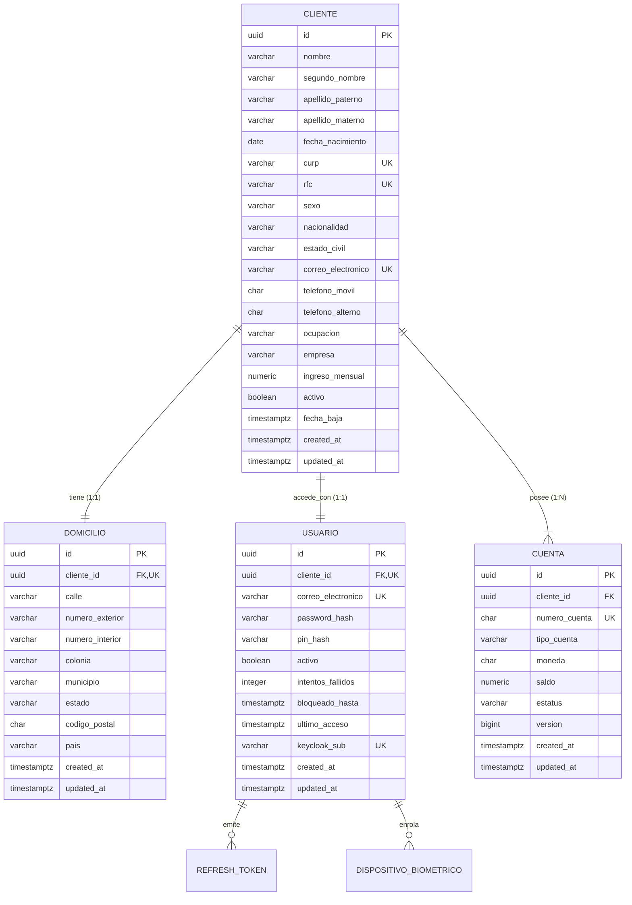
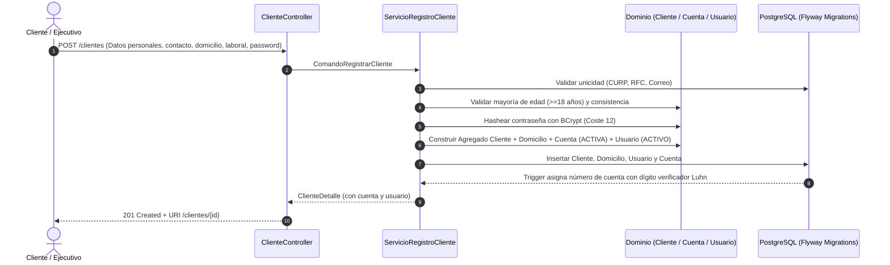

# Onboarding de Clientes Personas Físicas

API REST de alto rendimiento y grado bancario construida con **Spring Boot 3.4.x (Java 21 LTS)**, **PostgreSQL 16**, **Maven**, **Docker** y autenticación basada en **JWT / Keycloak**.

---

## 🏛️ Arquitectura del Sistema

El proyecto sigue los principios de **Arquitectura Hexagonal (Puertos y Adaptadores)** y **Feature Slicing**, garantizando un aislamiento total del modelo de dominio respecto a frameworks y detalles de infraestructura:

```
src/main/java/com/onboarding/clientes/
├── cliente/
│   ├── api/                      # Controladores REST, Request/Response DTOs con OpenAPI
│   │   ├── ClienteController.java
│   │   ├── CuentaController.java
│   │   ├── UsuarioController.java
│   │   └── AuthController.java
│   ├── application/              # Casos de uso, servicios, puertos y mappers
│   │   ├── command/
│   │   ├── dto/
│   │   ├── mapper/
│   │   ├── port/
│   │   └── service/
│   ├── domain/                   # Núcleo de negocio inmutable (sin Spring / JPA)
│   │   ├── exception/
│   │   ├── model/ (Cliente, Cuenta, Domicilio, Usuario)
│   │   └── valueobject/ (Curp, Rfc, Correo, Telefono, CodigoPostal, NumeroCuenta)
│   └── infrastructure/           # Adaptadores de persistencia JPA y Base de Datos
│       └── persistence/
│           ├── adapter/
│           ├── entity/
│           └── jpa/
├── config/                       # Configuración Spring Security, JWT, OpenAPI, Propiedades
└── shared/                       # Kernel compartido: Errores RFC 7807, Auditoría, Value Objects
```

---

## 📊 Diagrama Entidad - Relación (ERD)



---

## 🔄 Flujo Integral de Onboarding (Alta Atómica)



---

## 🚀 Endpoints REST Principales

| Método | Endpoint | Descripción | Acceso |
| :--- | :--- | :--- | :--- |
| `POST` | `/clientes` | Alta integral de cliente, domicilio, cuenta y usuario | Público |
| `GET` | `/clientes` | Listar clientes (con paginación por cursor y filtros) | Autenticado |
| `GET` | `/clientes/{id}` | Consultar cliente por ID (UUID v7) | Autenticado |
| `GET` | `/clientes/curp/{curp}` | Consultar cliente por CURP | Autenticado |
| `GET` | `/clientes/rfc/{rfc}` | Consultar cliente por RFC | Autenticado |
| `GET` | `/clientes/correo/{correo}` | Consultar cliente por Correo Electrónico | Autenticado |
| `GET` | `/clientes/cuenta/{numeroCuenta}` | Consultar cliente por Número de Cuenta | Autenticado |
| `PUT` | `/clientes/{id}` | Actualizar cliente (Protección de inmutabilidad de CURP/RFC) | Autenticado |
| `DELETE`| `/clientes/{id}` | Baja lógica de cliente (Inactiva cuentas y usuario en cascada) | Autenticado |
| `GET` | `/cuentas/{numeroCuenta}` | Consultar información de una cuenta bancaria | Autenticado |
| `GET` | `/cuentas/{numeroCuenta}/saldo` | Consultar saldo disponible de una cuenta | Autenticado |
| `GET` | `/cuentas/activas` | Listar cuentas activas paginadas por cursor | Autenticado |
| `POST` | `/auth/login` | Inicio de sesión con correo y contraseña (Emite JWT) | Público |
| `GET` | `/usuarios/{id}` | Consultar usuario de acceso | Autenticado |
| `PUT` | `/usuarios/{id}/password` | Cambio de contraseña con validación de complejidad | Autenticado |

---

## 🛠️ Ejecución y Pruebas

### 1. Compilación y Ejecución con Maven
```bash
# Compilar el proyecto
mvn clean compile

# Ejecutar las pruebas unitarias
mvn test

# Empaquetar el artefacto JAR ejecutable
mvn package -DskipTests
```

### 2. Despliegue con Docker Compose (PostgreSQL + Keycloak Ligero + API)
```bash
# Iniciar todos los servicios (Postgres, Keycloak y API)
docker compose up -d --build

# Verificar logs
docker compose logs -f onboarding-app
```

- **Swagger UI / Documentación interactiva**: `http://localhost:8080/swagger-ui.html`
- **Consola Keycloak**: `http://localhost:8081` (Admin: `admin` / `admin`)
- **Health Check Actuator**: `http://localhost:8080/actuator/health`
